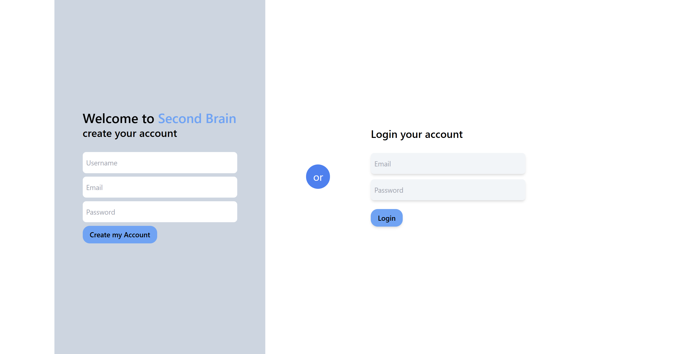
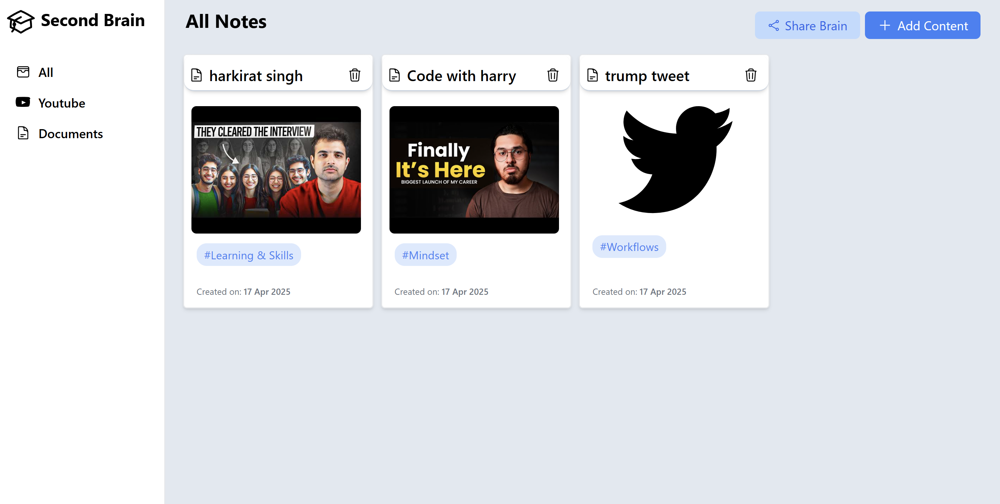
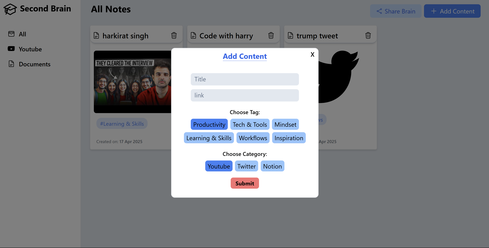

# 🧠 Second Brain – Your Digital Knowledge Hub

**Second Brain** is a full-stack web application designed to help users collect, organize, and access their ideas, resources, and learning materials all in one place. It functions like your own personal knowledge management system — sleek, responsive, and efficient.

> ✅ Deployed Live: [Click Me](https://second-brain-ochre.vercel.app)

---

## 🚀 Features

### 🗂️ Smart Organization
- Categorize and manage your content into tags like **YouTube**, **Documents**, or **All**.
- Filter content dynamically from the sidebar for quick access.

### 🏷️ Tagging & Metadata
- Add tags, titles, and creation dates to each card.
- Timestamped notes help track changes over time.

### 🔎 Fast Retrieval
- Instantly find and view cards by category or tag.
- Optimized for efficient browsing and knowledge recall.

### 🧩 Share Your Brain
- Share your curated knowledge (links/cards) with others.
- Collaborate and showcase your learning network.

### 💡 Intuitive UI
- Modular UI built with dynamic React components (Cards, Modals, Sidebar).
- Designed for clarity, minimalism, and ease of use.

### 📱 Fully Responsive
- Optimized for desktops, tablets, and smaller screens.

---

## 🧱 Tech Stack

| Frontend        | Backend            | Database     | Deployment       |
|----------------|--------------------|--------------|------------------|
| React + TypeScript | Express.js + Node.js | MongoDB Atlas | Vercel (Frontend), Render (Backend) |

---

## 🖼️ Screenshots

| Auth Page | Home Page | Add New Card |
|----------|-----------|---------------|
|  |  |  |

---

## 📂 Project Structure

```bash
Second-Brain/
│
├── App/                    # Frontend (React + TypeScript)
│   ├── src/
│   │   ├── components/     # Card UI, Modal UI, Sidebar
│   │   ├── pages/          # Home, Login, Register
│   │   ├── utils/          # Axios config, helpers
│   └── ...
│
├── Server/                 # Backend (Node.js + Express)
│   ├── config/             # DB connection
│   ├── controllers/        # Auth, Card handlers
│   ├── models/             # Mongoose models
│   ├── routes/             # API routes
│   └── app.ts              # Express app config
│
└── README.md               # Project documentation
